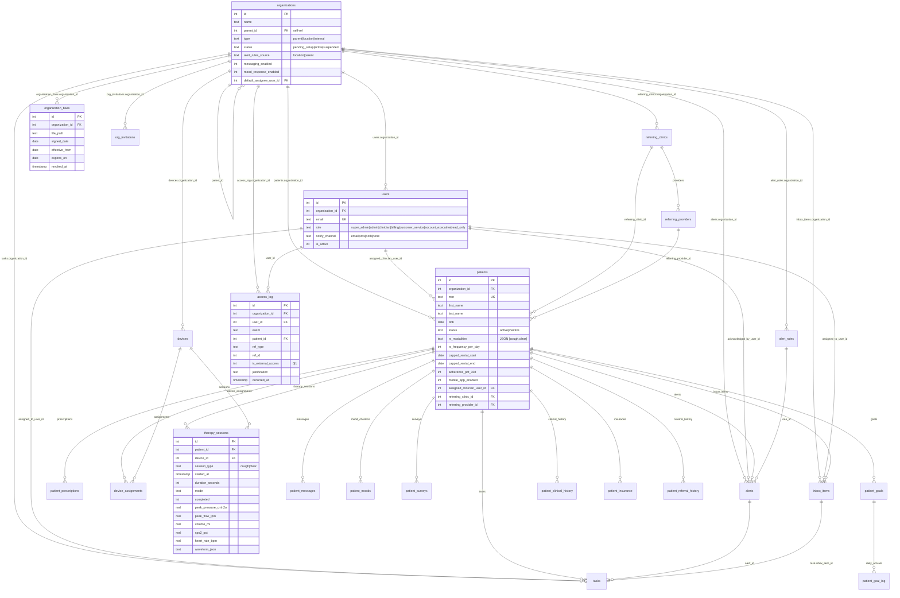

# Arc Connect Portal — R&D Implementation Plan

**Audience:** Engineering, QA, Security, Product
**Companion artifact:** working demo at `app.py` / `schema.sql` / `seed.py`
**Last updated:** 2026-04-27

---

## 1. Executive Summary

The Arc Connect Provider Portal is a multi-tenant clinical workflow application for HME and home-health organizations managing patients on **BiWaze Cough** (mechanical insufflator-exsufflator) and **BiWaze Clear** (oscillating PEP) respiratory therapy systems. The portal supports four organizational tiers:

1. **ABMRC (manufacturer / super admin)** — covered under signed BAAs with each customer; view-only oversight, support, and onboarding.
2. **Customer parent organization** (group/regional account, e.g., "Adapt Respiratory") — rolls up multiple satellite locations.
3. **Customer satellite location** (individual branch, e.g., "Adapt — Denver") — operates clinical workflows.
4. **Patient mobile app** (Arc Connect mobile) — communicates with the portal via a feature-gating API.

The portal is the **provider-side** of a closed-loop respiratory therapy system: device telemetry flows in, clinicians monitor adherence and trigger interventions, patients receive feedback through their paired mobile app.

---

## 2. User Requirements

### 2.1 Clinical user requirements (location admins, clinicians, billing)

| ID | Requirement |
|----|-------------|
| UR-1 | A clinician must see, within 3 clicks of login, every patient at their location whose 30-day adherence is below 80%. |
| UR-2 | A clinician must be able to drill into any patient and see therapy data, prescription, devices, alerts, mood check-ins, surveys, goals, insurance, and referring provider on a single page. |
| UR-3 | A clinician must be able to view a patient's full therapy session history, filter by device and date range, select multiple sessions, and print a compliance summary with optional metric trend charts. |
| UR-4 | An admin must be able to configure alert rules (metric, threshold, severity, notification channels) without engineering involvement. |
| UR-5 | An admin must be able to assign tasks to colleagues and see overdue tasks at a glance. |
| UR-6 | A clinician must be able to respond to patient-initiated messages and document mood/survey responses, with all engagement consolidated in a single Inbox. |
| UR-7 | All actions on PHI must be auditable; the admin must be able to filter the audit log by event type, user, location, and patient. |
| UR-8 | All views must be responsive between 960px and 1920px viewports. The primary use case is desktop; mobile parity is not required for v1. |

### 2.2 Group admin requirements (parent organization)

| ID | Requirement |
|----|-------------|
| UR-9 | A group admin must see a network rollup with totals across all satellite locations and a per-location leaderboard for adherence, alerts, and device utilization. |
| UR-10 | A group admin must be able to view consolidated lists of patients, devices, alerts, tasks, inbox items, and referring clinics across all satellite locations, filterable by location. |
| UR-11 | A group admin must be able to create new satellite locations and invite an initial admin to each. |
| UR-12 | A group admin must be able to choose whether each satellite location manages its own alert rules or whether the parent manages rules centrally. |
| UR-13 | A group admin must be able to see when ABMRC support staff has accessed their organization's data and the justification provided for each access. |

### 2.3 ABMRC super admin requirements

| ID | Requirement |
|----|-------------|
| UR-14 | A super admin must be able to onboard a new customer organization: capture org info, upload a signed BAA (PDF) with effective and expiry dates, and invite the initial parent admin — all in a single flow. |
| UR-15 | A super admin's access to any customer organization's data must be gated on an active, non-revoked, non-expired BAA on file. |
| UR-16 | A super admin must have read-only access to customer data; any state-changing request must be rejected at the framework level, not relying on per-route checks. |
| UR-17 | A super admin must be able to suspend or reactivate a customer organization (e.g., at contract end or BAA revocation). |
| UR-18 | Every PHI access by a super admin must be logged with the actor, the customer org, and a free-text justification. The customer parent admin must be able to see these events. |
| UR-19 | New super admins may only be granted by an existing super admin (no self-elevation; no customer-org admin can promote anyone to super admin). |

### 2.4 Patient mobile-app requirements (the portal as a backend)

| ID | Requirement |
|----|-------------|
| UR-20 | The mobile app must be able to query, per patient, which engagement features are enabled at their owning location: messaging, mood capture, mood-response free-text. |
| UR-21 | A patient's access to the portal's data flow must respect the location-level engagement flags AND the parent organization's master kill-switch (a parent disabling messaging globally overrides any child setting). |

---

## 3. System Requirements (high-level)

### 3.1 Functional system requirements

| ID | Requirement |
|----|-------------|
| SR-1 | Multi-tenant data isolation: every domain table (`patients`, `devices`, `alerts`, `tasks`, `referring_clinics`, etc.) carries an `organization_id` and queries always scope to it. Cross-tenant reads are only possible through the parent-rollup helper or super-admin scope. |
| SR-2 | Hierarchical org model: organizations form a parent → child tree. `type IN ('parent','location','internal')`. Location organizations have a non-null `parent_id` pointing to their group. ABMRC has `type='internal'`. |
| SR-3 | Role-based authorization: roles are `super_admin`, `admin`, `clinician`, `billing`, `customer_service`, `account_executive`, `read_only`. Authorization happens at route guards (`@require_login`, `@require_admin`, `_require_super_admin`) plus a global `before_request` hook that enforces super-admin view-only. |
| SR-4 | Unified status vocabulary: `tasks.status ∈ {todo, in_progress, pending_external, completed, cancelled}`. Inbox items derive their status from the linked task via `LEFT JOIN`. There is one source of truth for status per item. |
| SR-5 | Deterministic alert evaluation: `alert_rules` define metric + threshold + window. The evaluation job (out of v1 scope; alerts are seeded for demo) writes rows to `alerts`, optionally creating a linked task. |
| SR-6 | Feature-flag inheritance: parent's `messaging_enabled` flag is a master kill-switch; if off at parent, every child location's messaging is forced off regardless of local setting. Same logic for `mood_response_enabled`. |
| SR-7 | Append-only audit log: `access_log` is never updated or deleted. Every read of PHI (`patient_view`, `session_view`, `report_generate`) is logged with `(organization_id, user_id, event, patient_id, ref_type, ref_id, detail, is_external_access, justification, occurred_at)`. |
| SR-8 | BAA-gated super-admin access: drilling into a customer org checks for an `organization_baas` row with `revoked_at IS NULL AND expires_on >= today`. Failure blocks access. |

### 3.2 Non-functional system requirements

| ID | Requirement | Target |
|----|-------------|--------|
| NFR-1 | Page load (location dashboard, 100 patients) | p95 < 800 ms |
| NFR-2 | List page (parent rollup, 1000 patients) | p95 < 1500 ms |
| NFR-3 | Audit log writes are non-blocking | UI never fails because of an audit write failure |
| NFR-4 | All PHI at rest is encrypted | Database-level (TDE) + file-system-level for `static/uploads` |
| NFR-5 | All PHI in transit is TLS 1.2+ | Enforced at load balancer; no plaintext HTTP |
| NFR-6 | Session timeout | 30 min idle for clinical roles; 15 min for super admins |
| NFR-7 | Password / auth | MFA required for all users in v1.1; v1 demo uses session-based user picker placeholder |
| NFR-8 | Browser support | Chrome / Safari / Edge current and current-1 |
| NFR-9 | Accessibility | WCAG 2.1 AA: keyboard-navigable, color-contrast ≥ 4.5:1, ARIA labels on icon-only buttons |
| NFR-10 | Logging retention | Access log retained 6 years (HIPAA requirement) |

---

## 4. Entity-Relationship Diagram

GitHub renders Mermaid natively. Open this file on GitHub (or any Mermaid-aware viewer) to see the diagram graphically. The schema below is the v1 demo state.

> **Implementation note:** The full schema (with every column, FK, and CHECK constraint) lives in `schema.sql`. The diagram above shows the principal relationships and the columns most relevant to authorization and audit. Refer to `schema.sql` as the single source of truth.

---

## 5. User Roles & Permissions

### 5.1 Role catalog

| Role | Tenant | Primary use case | Can mutate PHI | Can manage users | Can manage org settings |
|------|--------|------------------|----------------|------------------|-------------------------|
| `super_admin` | ABMRC (internal) | Onboarding, support, BAA-covered oversight | **No** (read-only) | Only other super admins | Only own (ABMRC) org + create customer orgs |
| `admin` (parent) | Customer parent | Group rollup, satellite-location creation, policy | Yes | At parent + at all child locations | Yes (parent + cascading) |
| `admin` (location) | Customer satellite | Location operations, user mgmt, alert rules | Yes | At own location | At own location |
| `clinician` | Customer satellite | Patient care, alerts, tasks, messages | Yes (patient-facing data) | No | No |
| `billing` | Customer satellite | Insurance, prescriptions, reports | Read most, write insurance/prescription | No | No |
| `customer_service` | Customer satellite | Inbound calls, messaging | Read most, write tasks/messages | No | No |
| `account_executive` | Customer satellite | Sales-side relationship | Read-mostly | No | No |
| `read_only` | Any | Audit / observer | No | No | No |

### 5.2 Authorization enforcement layers

1. **Route decorators** — `@require_login`, `@require_admin`, `_require_super_admin`, `_require_parent_admin`. Reject on missing role.
2. **Org scope in queries** — `current_org_id()` gate on every domain query; `scope_org_ids()` for parent-rollup or super-admin-acting contexts.
3. **`before_request` hook** — global super-admin write block. Whitelist of write endpoints super admins ARE allowed to call (BAA upload, org create/suspend/activate, super-admin user invites). All other POST/PUT/DELETE for super admin → 302 with flash error.
4. **Template gating** — action buttons hidden when role lacks permission (defense in depth; the route guard is the real boundary).

### 5.3 Permissions matrix (functional capabilities × role)

Legend: ✅ allowed · 👁 read-only · ❌ denied · ⚠ limited

| Capability | super_admin | admin (parent) | admin (loc) | clinician | billing | cust_svc | acct_exec | read_only |
|---|---|---|---|---|---|---|---|---|
| View patient list (own org) | 👁 | ✅ | ✅ | ✅ | ✅ | ✅ | ✅ | 👁 |
| View patient list (any org under BAA) | 👁 | ❌ | ❌ | ❌ | ❌ | ❌ | ❌ | ❌ |
| Create / edit patient | ❌ | ✅ | ✅ | ✅ | ⚠ (insurance fields) | ❌ | ❌ | ❌ |
| Edit prescription | ❌ | ✅ | ✅ | ✅ | ✅ | ❌ | ❌ | ❌ |
| Assign device | ❌ | ✅ | ✅ | ✅ | ❌ | ❌ | ❌ | ❌ |
| View therapy data | 👁 | ✅ | ✅ | ✅ | 👁 | 👁 | 👁 | 👁 |
| Acknowledge/resolve alert | ❌ | ✅ | ✅ | ✅ | ❌ | ❌ | ❌ | ❌ |
| Create / complete task | ❌ | ✅ | ✅ | ✅ | ⚠ (own area) | ⚠ (messaging) | ❌ | ❌ |
| Reply to patient message | ❌ | ✅ | ✅ | ✅ | ❌ | ✅ | ❌ | ❌ |
| Configure alert rules | ❌ | ✅ (if parent-managed) | ✅ (if location-managed) | ❌ | ❌ | ❌ | ❌ | ❌ |
| Create satellite location | ❌ | ✅ | ❌ | ❌ | ❌ | ❌ | ❌ | ❌ |
| Manage users (own org) | ❌ | ✅ (parent + cascading) | ✅ (own loc) | ❌ | ❌ | ❌ | ❌ | ❌ |
| Create customer organization | ✅ (with BAA) | ❌ | ❌ | ❌ | ❌ | ❌ | ❌ | ❌ |
| Suspend / reactivate org | ✅ | ❌ | ❌ | ❌ | ❌ | ❌ | ❌ | ❌ |
| Upload BAA | ✅ | ❌ | ❌ | ❌ | ❌ | ❌ | ❌ | ❌ |
| View ABMRC access log | ❌ | 👁 (own org's events) | ❌ | ❌ | ❌ | ❌ | ❌ | ❌ |
| View internal audit log | ❌ | ✅ (cascading) | ✅ (own loc) | ❌ | ❌ | ❌ | ❌ | ❌ |

---

## 6. Phased Implementation Plan

The phases are ordered by build dependency. Each phase is self-contained and shippable; later phases assume the earlier ones are in place.

### Phase 0: Foundation
### Phase 1: Patient & Device Lifecycle
### Phase 2: Alerts & Tasks
### Phase 3: Patient Engagement
### Phase 4: Reporting & Audit
### Phase 5: Multi-Location Parent Rollup
### Phase 6: ABMRC Super Admin & BAA Lifecycle
### Phase 7: Mobile App Integration & Polish

---

## Phase 0 — Foundation

### Epic 0.1: Database schema & migration system

**User need:** Engineers need a single source of truth for the data model and a way to evolve it safely.

**User stories**
- As an engineer, I can re-create the entire schema from `schema.sql` so a new dev environment matches production.
- As an engineer, I can run a migration that adds a column without losing existing data.
- As QA, I can run `seed.py` against an empty DB and get a deterministic, demo-ready dataset.

**System requirements**
- SR 0.1.1: All tables, indexes, and CHECK constraints defined declaratively in `schema.sql`.
- SR 0.1.2: A seed script (`seed.py`) that produces a complete demo dataset including super admin, customer parent, satellite locations, users across all roles, patients with prescriptions, devices, therapy sessions, alerts, tasks, surveys, moods, goals, BAA, audit events.
- SR 0.1.3: Timestamps default `CURRENT_TIMESTAMP`; foreign keys enforce `ON DELETE` semantics intentionally (CASCADE for child collections, SET NULL for soft references).
- SR 0.1.4: Migration framework (Alembic for production deployment; v1 demo recreates from schema.sql on each seed). Track applied migrations in `schema_migrations` table.

**Acceptance criteria**
- `rm arcconnect.db && python3 seed.py` exits 0 and produces a DB with at least 1 super admin, 1 parent, 3+ satellites, 15+ patients, 1000+ therapy sessions, 1+ BAA, 1+ active alert.
- All tables in `schema.sql` are referenced by at least one query in `app.py`.
- ER diagram in this document matches the actual schema exactly.

**Dependencies:** none.

---

### Epic 0.2: Authentication & session management

**User need:** Users need to log in, stay logged in across pages, and be authorized based on their role.

**User stories**
- As a user, I can log in once and navigate the portal without re-authenticating until my session expires.
- As an admin, I can deactivate a user without deleting them, and a deactivated user can no longer log in.
- As a super admin, I get a shorter session timeout because my reach is wider.

**System requirements**
- SR 0.2.1: Session storage: server-side signed cookie, HTTP-only, Secure, SameSite=Lax.
- SR 0.2.2: Session timeout: 30 min idle for clinical roles; 15 min for super_admin (configured in `app.permanent_session_lifetime` or equivalent).
- SR 0.2.3: Session refresh on every authenticated request.
- SR 0.2.4: `current_user()` returns the user row with org metadata joined (org_name, org_type, org_parent).
- SR 0.2.5: `@require_login` redirects unauthenticated requests to `/login`.
- SR 0.2.6: `@require_admin` returns 403 for non-admin roles.
- SR 0.2.7: V1.1 — MFA via TOTP (RFC 6238), QR enrollment on first login, recovery codes.
- SR 0.2.8: V1.1 — password storage with Argon2id (memory ≥ 64 MB, iterations ≥ 3, parallelism ≥ 1).

**Acceptance criteria**
- Login screen lists active users; selecting and submitting authenticates the session.
- Visiting any `/dashboard` URL without a session redirects to `/login`.
- A deactivated user (`is_active = 0`) cannot log in.
- Session cookie has `HttpOnly` and `Secure` flags set in production config.

**Dependencies:** 0.1.

---

### Epic 0.3: Multi-tenant organization model

**User need:** The platform must isolate one customer's data from another's, while supporting parent → child organization hierarchies.

**User stories**
- As an Adapt clinician, I never see Sunwest Medical's patients.
- As a Karen (Adapt parent admin), I see all my satellite locations rolled up.
- As Karen, I can switch into one specific satellite location and operate as if I were a location admin there.
- As ABMRC, my "organization" exists in the same table but is type=internal.

**System requirements**
- SR 0.3.1: `organizations.type ∈ {parent, location, internal}` with CHECK constraint.
- SR 0.3.2: `organizations.parent_id` is a self-referential FK; null for parent and internal types.
- SR 0.3.3: `current_org_id()` resolves to: super-admin acting target → that org id; parent admin with `acting_org_id` → that location id; otherwise → user's `organization_id`.
- SR 0.3.4: `scope_org_ids()` resolves to: super admin acting → customer parent + its children; parent admin at rollup → all child locations; otherwise → `[current_org_id()]`. This is the canonical helper for every list-page query.
- SR 0.3.5: A parent admin can switch into any location whose `parent_id == their organization_id`. Any other switch returns 403.
- SR 0.3.6: Location switch endpoint: `GET /switch-location/<org_id>` sets `session.acting_org_id` if authorized; clearing acts as "return to parent rollup".

**Acceptance criteria**
- Three test fixtures: Karen (parent), Priya (Denver location admin), Maria (Sunwest standalone).
- Karen at rollup sees aggregate data across Denver + Boulder + Phoenix.
- Karen switches to Denver; her queries now scope to Denver only.
- Priya cannot switch; if she tries the switch endpoint with another location id, she gets 403.
- Maria's Sunwest queries never return Adapt data.

**Dependencies:** 0.1, 0.2.

---

### Epic 0.4: Audit logging infrastructure

**User need:** HIPAA requires every PHI access to be logged. The system needs a single helper to write audit entries from anywhere in the codebase, with no risk of breaking the request when logging fails.

**User stories**
- As a security officer, I can prove that every patient detail page view was logged.
- As an admin, I can see who looked at which patient's record on which date.
- As an engineer, I can call a single function `_log_access(event, patient_id=…, …)` from any route, without worrying about transactional state.

**System requirements**
- SR 0.4.1: `_log_access(event, patient_id=None, ref_type=None, ref_id=None, detail=None, justification=None)` writes to `access_log`. Wrapped in try/except — logging failure must NOT propagate.
- SR 0.4.2: `is_external_access` automatically set to 1 when actor is `is_super_admin()`; supports the reciprocal audit feature (Phase 6).
- SR 0.4.3: Events: `patient_view`, `session_view`, `report_generate`, `data_export`, `task_activity`, `location_create`, `location_update`, `user_create`, `user_update`. Each event documented with semantic meaning.
- SR 0.4.4: Index on `(organization_id, occurred_at DESC)`, `(patient_id, occurred_at DESC)`, `(user_id, occurred_at DESC)`.
- SR 0.4.5: Retention policy: 6 years (HIPAA). Implement a periodic archival job in v1.1 (out of scope for v1).

**Acceptance criteria**
- Opening a patient detail page writes one `patient_view` row.
- Opening a session detail writes one `session_view` row.
- Generating the printable report writes one `report_generate` row.
- A simulated DB error during `_log_access` does NOT 500 the page.

**Dependencies:** 0.1, 0.2, 0.3.

---

## Phase 1 — Patient & Device Lifecycle

### Epic 1.1: Patient registry

**User need:** A clinician needs to register a new patient under their location, capture demographics, and assign a clinician.

**User stories**
- As a clinician, I can add a new patient with name, DOB, MRN, contact, address, language preference, diagnosis, prescribed modalities.
- As a clinician, I can edit an existing patient's record without losing referential integrity to their sessions/devices/alerts.
- As an admin, I can deactivate a patient (soft-delete) without removing them from history.
- As any user, I can see a patient list with adherence, last-session date, alert count, and clinician assignment.

**System requirements**
- SR 1.1.1: `patients` table with columns from schema.sql (mrn, name, dob, contact, address, status, rx_modalities JSON, rx_frequency_per_day, capped_rental dates, adherence_pct_30d, mobile_app fields, FKs to clinician/clinic/provider).
- SR 1.1.2: `patients.organization_id` is the location id (not parent). Parent admins access children's patients via `scope_org_ids()`.
- SR 1.1.3: Soft delete via `status = 'inactive'`; never hard-delete a patient.
- SR 1.1.4: Search/filter by name, MRN, status, modality, clinician, adherence bucket.
- SR 1.1.5: List page sortable on every column; clickable rows route to patient detail.

**Acceptance criteria**
- Add patient form rejects duplicate MRN within the same organization.
- Editing the patient updates the record without losing therapy session links.
- Deactivating a patient hides them from the default list but preserves them under `status=inactive` filter.
- Server-side sort + filter return correct results for every column header.

**Dependencies:** 0.1, 0.2, 0.3, 0.4.

---

### Epic 1.2: Prescriptions

**User need:** A patient's BiWaze prescription drives every clinical workflow downstream — therapy goals, alert thresholds, device settings.

**User stories**
- As a clinician, I can capture a Cough or Clear prescription with all device settings (cycles, pressures, times, neb, oxygen).
- As a clinician, I can upload the paper Rx PDF / image alongside the structured fields.
- As a billing user, I can see the prescribing physician and provider.
- As a clinician, I can update an Rx without losing the prior version (history preserved by deactivating + re-inserting).

**System requirements**
- SR 1.2.1: `patient_prescriptions` with one row per modality per patient; `is_active = 1` for current.
- SR 1.2.2: Upload accepts PDF, JPG, PNG, TIFF up to 10 MB; stored under `static/uploads/prescriptions/`; safe filenames (secure_filename + patient id + modality + ts).
- SR 1.2.3: Pressures stored as integers (whole numbers) per clinical convention.
- SR 1.2.4: PEP / OSC times entered as minutes + seconds in the form, stored as total seconds.
- SR 1.2.5: When a new Rx is saved, the existing active Rx for that modality is set to `is_active = 0` (history preserved).

**Acceptance criteria**
- A patient prescribed both Cough and Clear has two active Rx rows.
- Updating the Cough Rx leaves the Clear Rx untouched and creates a new Cough row with the previous one deactivated.
- Uploading an unsupported file type shows a flash error and rejects the form.

**Dependencies:** 1.1.

---

### Epic 1.3: Device inventory & assignment

**User need:** A location maintains a device inventory and assigns devices to patients with a consent form on file.

**User stories**
- As an admin, I can add a device to inventory (model, serial, firmware) and mark its status (in_stock, in_use, maintenance, retired).
- As a clinician, I can assign an in-stock device to a patient at the time of home setup, with a consent form upload.
- As a clinician, I can return a device to inventory when therapy ends.
- As any user, I can see which patient currently has a given device, when it was assigned, and the consent form.

**System requirements**
- SR 1.3.1: `devices` table with model (`biwaze_cough` | `biwaze_clear`), serial_number (unique), firmware_version, status, last_communication.
- SR 1.3.2: `device_assignments` table — patient × device with `assigned_date` and `returned_date` (null = active).
- SR 1.3.3: A device may not have two simultaneously-active assignments (DB-level constraint or application-level check).
- SR 1.3.4: Consent form upload (PDF) stored under `static/uploads/consent/` with metadata.
- SR 1.3.5: Device list page filters by status + assignment state; sortable columns.

**Acceptance criteria**
- Assigning an in_use device to a different patient first requires returning the prior assignment.
- Upon assignment, `devices.status` is updated to `in_use`; upon return, back to `in_stock`.
- Consent form is required at assignment time.

**Dependencies:** 1.1.

---

### Epic 1.4: Therapy session ingestion & history

**User need:** Device telemetry must arrive in the portal so clinicians can monitor adherence and trend metrics over time.

**User stories**
- As a clinician, I see a patient's last 30 days of therapy sessions with metrics per session.
- As a clinician, I can drill into one session and view the pressure waveform plus optional SpO₂ and Heart Rate tracks (if the patient is paired with a pulse-ox).
- As a clinician, I can see the full historical session list, filter by device and date range, select multiple sessions, and print a compliance summary with optional metric trends.
- As a clinician, the Volume / Peak Cough Flow / Peak Insp Pressure / Peak Pressure / SpO₂ / Heart Rate trend chart appears only when the patient has data for that metric.

**System requirements**
- SR 1.4.1: `therapy_sessions` table with patient_id, device_id, session_type, started_at, duration_seconds, mode, completed, peak_pressure_cmh2o, peak_flow_lpm, volume_ml, spo2_pct, heart_rate_bpm, waveform_json (TEXT containing samples + optional spo2_samples + hr_samples), notes.
- SR 1.4.2: Ingestion endpoint (out of v1 demo scope; sessions are seeded). When implemented: HMAC-signed POST from device gateway; idempotent (dedupe by `(device_id, started_at)`); validates session_type matches device.model.
- SR 1.4.3: Patient session history page paginates if > 200 rows; filterable by modality + start/end date.
- SR 1.4.4: Print page accepts `ids[]` POST (comma-separated GET fallback) and renders one card per session with the pressure waveform inline as SVG.
- SR 1.4.5: Metric-picker conditional rendering: BiWaze Cough group shown only if patient has cough sessions; BiWaze Clear group only if has clear; Vitals group only if any session carries spo2 or heart_rate. Each group enforces "select one" via inline JS.
- SR 1.4.6: Adherence calculation: `(min(sessions_completed, goal) / goal) × 100` over a rolling 30-day window, where goal = `THERAPY_GOAL_PER_DAY × 30 × len(rx_modalities)`.

**Acceptance criteria**
- A patient with 2 cough sessions/day for the last 30 days shows 100% adherence.
- A patient with no clear sessions but a clear Rx shows the clear adherence as 0%.
- The print view's trend chart displays 1 chart per checked metric, with x-axis = date, y-axis = metric value, polyline + dots.
- Selecting "Volume" trends shows a chart only for patients who have volume_ml data.

**Dependencies:** 1.1, 1.2, 1.3.

---

### Epic 1.5: Patient detail dashboard

**User need:** All clinical context for a single patient on one page, with a sticky sidebar for quick navigation between sections.

**User stories**
- As a clinician, I open a patient and can scroll through Therapy / Alerts / Prescription / Device / Journey / Clinical history / Goals / Mood / Surveys / Insurance / Referring on one page.
- As a clinician, I can click any section in the sidebar to scroll to it and see a count badge of items in that section.
- As a clinician, I can open the chip popover on the BiWaze Cough or Clear adherence chip from the patient list and see a mini journey + alerts without navigating away.

**System requirements**
- SR 1.5.1: Section order controlled by CSS flex `order:` so it can be re-tuned without re-templating.
- SR 1.5.2: Sticky sidebar nav with scroll-spy highlighting the active section.
- SR 1.5.3: Section count badges driven by template variables passed from the route handler.
- SR 1.5.4: Each section card's content lazy-renders data fetched in the route handler; no client-side data fetching for v1.
- SR 1.5.5: Chip popover endpoint returns JSON with adherence narrative + active alerts + journey events.

**Acceptance criteria**
- Sidebar renders correct counts for every section based on actual DB content.
- Clicking a sidebar entry smooth-scrolls and highlights the section.
- The popover opens within 200 ms of click; closes on outside click or Esc.

**Dependencies:** 1.1, 1.2, 1.3, 1.4.

---

### Epic 1.6: Insurance management

**User need:** Each device a patient is on has its own insurance approval and authorization.

**User stories**
- As a billing user, I record a patient's insurance info (payer, member id, group, coverage type, plan dates).
- As a billing user, I capture per-device approval dates and authorization numbers (cough_approval_date, cough_auth_number, clear_approval_date, clear_auth_number).
- As any user, I see the insurance section on patient detail showing only the fields relevant to the patient's prescribed modalities.

**System requirements**
- SR 1.6.1: `patient_insurance` table with payer details + per-device approval columns.
- SR 1.6.2: Form shows BiWaze Cough fields only if patient has cough Rx; same for clear.
- SR 1.6.3: One active insurance row per patient (most recent wins; history preserved).

**Acceptance criteria**
- A patient prescribed only cough sees only cough approval fields.
- Updating insurance preserves prior history.

**Dependencies:** 1.1, 1.2.

---

### Epic 1.7: Clinical history

**User need:** Clinicians document observations (SpO₂, FEV1, FVC, oxygen therapy) and hospital admissions over time.

**User stories**
- As a clinician, I add a clinical observation row with date, optional admission/discharge, SpO₂, spirometry, oxygen status, notes.
- As a clinician, I see the most recent 3 observations on patient detail and a "View all" link to the full history.

**System requirements**
- SR 1.7.1: `patient_clinical_history` table with observation_date, hospital_admission_date, hospital_discharge_date, admission_reason, spo2_pct, fev1_liters, fev1_pct_predicted, fvc_liters, fvc_pct_predicted, on_oxygen_therapy, oxygen_flow_lpm, oxygen_type, notes, recorded_by_user_id.
- SR 1.7.2: Append-only by convention; edits create new rows rather than overwriting.

**Acceptance criteria**
- Adding an observation appears as the newest entry on patient detail within one page refresh.

**Dependencies:** 1.1.

---

### Epic 1.8: Referring clinics & providers

**User need:** Each location maintains a directory of physician practices that refer patients, with multiple providers per clinic.

**User stories**
- As an admin, I add a referring clinic with NPI, contact info, and address.
- As an admin, I add referring providers (physicians) under each clinic with credentials and specialty.
- As a clinician registering a patient, I select the referring clinic and provider from drop-downs (provider list filtered by selected clinic).
- As an admin, I see how many active patients each clinic / provider has referred.

**System requirements**
- SR 1.8.1: `referring_clinics` and `referring_providers` tables, scoped to organization.
- SR 1.8.2: `patient_referral_history` (append-only) records every time a patient's referring clinic/provider changes.
- SR 1.8.3: Map view (Leaflet) optional — pins each clinic by lat/lon for visual rollup.

**Acceptance criteria**
- Selecting a provider auto-fills the clinic field on patient registration.
- Referral changes are visible in patient detail's Referring section history.

**Dependencies:** 0.3, 1.1.

---

## Phase 2 — Alerts & Tasks

### Epic 2.1: Alert rules engine

**User need:** Each location (or its parent, depending on policy) configures what triggers an alert and who gets notified.

**User stories**
- As an admin, I create an alert rule for "Missed Therapy Days >= 2" with severity = critical.
- As an admin, I disable a rule without deleting it.
- As an admin, I choose notification channels (email, in-app, text) and recipient roles.

**System requirements**
- SR 2.1.1: `alert_rules` table: name, description, metric, threshold_value, window_hours, severity (info|warning|critical), notify_email/in_app/sms, notify_recipient_roles (JSON array), is_active.
- SR 2.1.2: Supported metrics: `missed_therapy_days`, `device_disconnected_hours`, `adherence_pct_drop`. (Removed in v1: peak_pressure_deviation_pct, rental_milestone_days.)
- SR 2.1.3: Evaluation job (scheduled, out of v1 demo scope) computes each metric per active patient and writes new `alerts` rows when threshold crossed.

**Acceptance criteria**
- A new alert rule appears in the rules list immediately.
- Disabling a rule prevents new alerts of that type from being created.

**Dependencies:** 0.3, 1.1, 1.4.

---

### Epic 2.2: Alert lifecycle

**User need:** When an alert fires, the right team member acknowledges it, investigates, and resolves it.

**User stories**
- As a clinician, I see new alerts on the dashboard and on the Alerts page.
- As a clinician, I acknowledge an alert (signals "I've seen this; investigating") and later resolve it.
- As a clinician, I bulk-acknowledge or bulk-resolve multiple alerts.
- As an admin, an alert can spawn a linked task with a default due date driven by severity (critical = 4 h, warning = 24 h, info = 72 h).

**System requirements**
- SR 2.2.1: `alerts` table: organization_id, patient_id, rule_id, triggered_at, severity, metric_value, message, detail, acknowledged_at/by, resolved_at/by, dismissed_at/by.
- SR 2.2.2: Bulk endpoint `POST /alerts/bulk` accepts ids[] + action (acknowledge|resolve).
- SR 2.2.3: Linking alert to task via `tasks.alert_id`. Resolving an alert auto-completes any open linked task.

**Acceptance criteria**
- Acknowledging an alert moves it visually but doesn't remove it from "Active".
- Resolving removes from "Active" view and appears in "All".
- Bulk action with 0 ids selected shows a flash error.

**Dependencies:** 2.1.

---

### Epic 2.3: Task workflow

**User need:** All clinical follow-up actions live in a single task system with a unified status vocabulary.

**User stories**
- As a clinician, I see "My tasks" on first opening the Tasks page; I can switch to All open / Overdue / Pending external / Completed / All.
- As a clinician, I bulk-reassign tasks to a colleague or bulk-complete them.
- As a clinician, an overdue task is visually highlighted.

**System requirements**
- SR 2.3.1: `tasks` table: organization_id, title, description, status (todo|in_progress|pending_external|completed|cancelled), priority (high|normal|low), due_at, assigned_to_user_id, created_by_user_id, patient_id, alert_id, inbox_item_id, created_at, updated_at.
- SR 2.3.2: `task_activity` table records every status change / reassignment for activity timeline on task detail.
- SR 2.3.3: Tasks are sortable by every column on the list page.

**Acceptance criteria**
- An assigned-to-me task appears under "My tasks" tab.
- Reassigning a task moves it out of "My tasks" into the assignee's view.
- Completing a task auto-completes any linked inbox item.

**Dependencies:** 2.2.

---

### Epic 2.4: Notification routing

**User need:** When a task is assigned or reassigned, the recipient gets an email or text per their preference.

**User stories**
- As a user, I configure my profile to receive email-only / text-only / both / in-app only.
- As a user, my phone is used for text fallback (separate SMS phone removed in v1).

**System requirements**
- SR 2.4.1: `users.notify_channel ∈ {email, sms, both, none}`.
- SR 2.4.2: Notification stub function — production: SendGrid for email, Twilio for SMS. v1 demo: log to app logger.
- SR 2.4.3: Trigger on task assign + reassign + due-soon job (out of v1).

**Acceptance criteria**
- Assigning a task to a user with `notify_channel='email'` writes an EMAIL log line.
- A user with `none` gets no log line.

**Dependencies:** 2.3.

---

## Phase 3 — Patient Engagement

### Epic 3.1: Inbox unified queue

**User need:** All patient-initiated communication (messages, surveys, mood notes) lands in a single triage queue.

**User stories**
- As a clinician, I see Open / My items / Completed / All tabs on the inbox.
- As a clinician, I can filter by item type (Messages / Surveys / Moods).
- As a clinician, opening an item shows the full thread / score / mood emoji and lets me reply, assign, or complete.

**System requirements**
- SR 3.1.1: `inbox_items` table: organization_id, patient_id, kind (message|survey|mood), ref_id, assigned_to_user_id, created_at.
- SR 3.1.2: Inbox status is derived from the linked task via `LEFT JOIN tasks t ON t.inbox_item_id = i.id`. Single source of truth.
- SR 3.1.3: Each inbox kind has its own detail rendering (message thread, survey score + open response, mood emoji + note).

**Acceptance criteria**
- Replying to a message creates a new `patient_messages` row and updates the linked task to in_progress.
- Marking an inbox item complete also marks the linked task complete.

**Dependencies:** 2.3.

---

### Epic 3.2: Patient messaging

**User need:** Two-way messaging between patient (mobile app) and clinician (portal).

**User stories**
- As a patient, I send a message from the mobile app; it appears in my clinic's inbox.
- As a clinician, I reply; the patient receives a push notification on their app.
- As an admin, I can globally disable messaging for my location; this hides the composer in the mobile app and stops new messages from appearing in the inbox.

**System requirements**
- SR 3.2.1: `patient_messages` table: patient_id, direction (from_patient|from_provider), body, author_user_id (null for from_patient), created_at.
- SR 3.2.2: Mobile app polls `/api/patient/<id>/features` on app open; respects `messaging_enabled`.
- SR 3.2.3: Parent's messaging flag is master kill-switch; when off, every child location's messaging is forced off.

**Acceptance criteria**
- Disabling messaging at the parent level immediately hides the composer for every child location's patients (via the API).

**Dependencies:** 3.1.

---

### Epic 3.3: Mood check-ins

**User need:** Daily one-tap mood capture from the patient with an optional free-text response on unfavorable moods.

**User stories**
- As a patient, I tap one of four mood emojis daily; if I select sad/meh, I can add a written note.
- As a clinician, I see a 30-day mood strip on patient detail with each day's worst mood color-coded (Inside Out palette: Joy/yellow, Disgust/green, Fear/purple, Sadness/blue).
- As an admin, I can disable the free-text response field independently of messaging.

**System requirements**
- SR 3.3.1: `patient_moods` table: patient_id, mood (sad|meh|ok|happy), response_text, recorded_at.
- SR 3.3.2: Multiple moods per day allowed; the displayed daily mood is the worst (sad < meh < ok < happy).
- SR 3.3.3: `mood_response_enabled` toggle; mood capture itself always remains on.

**Acceptance criteria**
- Mood strip shows a dot per day for the last 30 days; missing days show a muted placeholder.
- Disabling response text on the parent disables it for all children.

**Dependencies:** 3.1.

---

### Epic 3.4: Surveys (30/60/90-day)

**User need:** Structured patient-experience surveys at fixed milestones.

**User stories**
- As the system, I push a survey to the patient at 30 / 60 / 90 days post-Rx start.
- As a patient, I complete the survey on the mobile app or opt out with a reason.
- As a clinician, I see milestone status on patient detail: scheduled / sent / completed (with score) / opted out.

**System requirements**
- SR 3.4.1: `patient_surveys` table: patient_id, milestone (30|60|90), sent_at, completed_at, score_0_100, q1..qN, q6_open_response, opted_out, opted_out_at, opted_out_reason.
- SR 3.4.2: Survey questions are constants (`SURVEY_QUESTIONS` in app.py) for v1; configurable in v1.1.

**Acceptance criteria**
- A patient passing day 30 with no completed survey shows "30-day survey overdue" badge.

**Dependencies:** 3.1.

---

### Epic 3.5: Patient goals tracking

**User need:** Patients track goals in the mobile app — therapy sessions/day, vest, breathing treatments, steps, sleep — and clinicians see the weekly view + history.

**User stories**
- As a patient, I see my current-week progress on each active goal.
- As a clinician, on patient detail I see the current-week goals strip with daily bars (hit/partial/miss/future).
- As a clinician, I open the Goals history page and filter by date range and goal type.

**System requirements**
- SR 3.5.1: `patient_goals` (active goal definitions) + `patient_goal_log` (daily actuals). Goal types: therapy_cough, therapy_clear, vest, breathing_treatment, steps, sleep.
- SR 3.5.2: Therapy_* goals derive their daily actual from `therapy_sessions` count for that modality on that day; others come from mobile-app self-report.
- SR 3.5.3: Goal target values: therapy = 2 sessions/day (default); vest 2-3; breathing 2-4; steps 3000-6000; sleep 7-8 hr.

**Acceptance criteria**
- Current-week strip shows correct met-day count vs eligible-day count.
- Goals history page renders 30 day-blocks per active goal, color-bar height proportional to actual/target.

**Dependencies:** 1.1, 1.4.

---

## Phase 4 — Reporting & Audit

### Epic 4.1: Therapy compliance report

**User need:** A printable PDF-quality compliance report for one patient over 30/60/90 days or custom range.

**User stories**
- As a clinician, I click "Print Therapy Summary" and pick 30/60/90 days or a custom date range.
- As a billing user, the report includes total sessions, days with no therapy, average pressure ± SD, average phases per session, adherence %, capped-rental status.
- As any user, the report opens in a new tab and is browser-printable as PDF.

**System requirements**
- SR 4.1.1: `/patients/<id>/report` route accepts `range=30|60|90` or `start=&end=`.
- SR 4.1.2: Renders one report page per prescribed modality.
- SR 4.1.3: Includes patient demographics, prescription summary, adherence chart, sessions table, signature block.
- SR 4.1.4: Print-only CSS via `@media print`.

**Acceptance criteria**
- Report generates within 1 s for a patient with 90 days of data.
- Browser "Print" produces a Letter-sized PDF with no overflow.

**Dependencies:** 1.4.

---

### Epic 4.2: Selected-sessions print + metric trending

**User need:** Pick specific sessions and print a summary with optional metric-trend charts across them.

**User stories**
- As a clinician, on the patient session history page, I check 5 sessions and select "Peak Cough Flow" and "Volume" trend metrics.
- The print page shows two trend charts at the top (one per metric) plus one card per session with the pressure waveform.

**System requirements**
- SR 4.2.1: `/patients/<id>/sessions/print` accepts ids[] + metrics[].
- SR 4.2.2: Metric whitelist enforced server-side: `peak_cough_flow, volume, peak_insp_pressure, peak_pressure, spo2, heart_rate`.
- SR 4.2.3: Conditional metric-picker UI: BiWaze Cough group only if patient has cough sessions in scope; same for clear; vitals only if any session has spo2/heart_rate.
- SR 4.2.4: "Select one" enforcement per group via inline JS; submitting without metrics is allowed (no trend charts shown).

**Acceptance criteria**
- A patient with 0 vitals data shows no Vitals group in the picker.
- Selecting two metrics in different groups (e.g., Peak Cough Flow + SpO₂) renders two trend charts.

**Dependencies:** 1.4.

---

### Epic 4.3: Access log / audit trail

**User need:** Compliance officers and admins can review every PHI access.

**User stories**
- As a location admin, I see a chronological audit log filterable by event, user, and patient.
- As a parent admin, I see all child locations' events combined and can filter by location.
- As a parent admin, I see a separate "ABMRC access" tab listing every super-admin access of my data with the justification recorded.

**System requirements**
- SR 4.3.1: Audit log page paginates at 500 rows/page.
- SR 4.3.2: Two top-level tabs: Portal events (`is_external_access=0`) and ABMRC access (`is_external_access=1`).
- SR 4.3.3: Filters: event, user, location (parent admin only), patient.
- SR 4.3.4: Counts shown on each tab badge.

**Acceptance criteria**
- A location admin cannot see another location's events.
- A parent admin's audit log includes all child-location events.
- The ABMRC tab shows justification text from `access_log.justification` for every super-admin row.

**Dependencies:** 0.4, 0.3.

---

## Phase 5 — Multi-Location Parent Rollup

### Epic 5.1: Parent organization dashboard

**User need:** A group admin sees the network at a glance — totals, leaderboard, adherence distribution, map.

**User stories**
- As a parent admin, on `/parent` I see KPI tiles for total patients, devices, active alerts, locations.
- As a parent admin, I see an adherence-distribution histogram and a per-location leaderboard ranking each metric.
- As a parent admin, I see a map of my locations with hotspots.

**System requirements**
- SR 5.1.1: Histogram bucket logic: 0-19, 20-39, 40-59, 60-79, 80-100 % adherence; bars colored using brand palette (BiWaze Cough orange for at-risk, slate for warning, brand cyan for on-track).
- SR 5.1.2: Leaderboard: each metric × location gets a tier (best/mid/worst) colored cyan/neutral/orange.
- SR 5.1.3: Network map uses Leaflet with OpenStreetMap tiles.

**Acceptance criteria**
- A parent with 3 active locations sees 3 leaderboard rows.
- Histogram counts sum to total active patients across all locations.

**Dependencies:** 0.3, 1.1.

---

### Epic 5.2: Cross-location lists (parent rollup)

**User need:** A group admin operates from flat, sortable, filterable tables that span all locations.

**User stories**
- As a parent admin, on `/parent/patients` I see one flat table with a Location column and a location filter.
- As a parent admin, I can sort by any column (Patient name, Location, Disease, Cough %, Clear %, Alerts) globally across all locations.
- Same pattern applies to `/parent/devices`, `/parent/alerts`. For Tasks, Inbox, Referring (shared templates), the location filter + Location column appear only in rollup mode.

**System requirements**
- SR 5.2.1: `scope_org_ids()` returns the children of the parent at rollup; result drives `WHERE organization_id IN (?)` clause everywhere.
- SR 5.2.2: Each row carries `loc_id` + `loc_name`; rendered as a colored chip (palette indexed by `loc_id % palette_size`).
- SR 5.2.3: Filter dropdown narrows to a single location; chip color stays consistent.
- SR 5.2.4: Sorting is server-side for parent_patients (uses `_PATIENT_SORT_CONFIG`), client-side for parent_devices and parent_alerts (via `<table class="sortable">`).
- SR 5.2.5: Tab-based view filters (Active/Inactive, All/Assigned/Unassigned, Active-only/All) replaced with dropdown filters for visual consistency with other rollup pages.

**Acceptance criteria**
- Filtering parent_patients by Denver shows only Denver patients; user count and adherence histogram are unaffected (frame of reference is preserved).
- Sorting by Location groups all Denver rows together.

**Dependencies:** 5.1.

---

### Epic 5.3: Location switching

**User need:** A parent admin needs to operate as if they were a location admin to perform mutating actions.

**User stories**
- As a parent admin, the top-bar location pill shows my parent org name + "All locations".
- I open the dropdown and pick a satellite; the URL `acting_org_id` flag flips and every page now scopes to that location.
- I pick the parent again to return to rollup.

**System requirements**
- SR 5.3.1: `session.acting_org_id` set by `/switch-location/<id>`; cleared when picking the parent.
- SR 5.3.2: Top-bar UI: stacked label — primary (account name) + secondary ("All locations" or location name).
- SR 5.3.3: Dropdown lists parent + each child location with ✓ on the active one.
- SR 5.3.4: Returning to parent redirects to `/parent`; switching to a child redirects to `/dashboard`.

**Acceptance criteria**
- Karen at Denver sees Denver-only patients; clicking parent → sees rolled-up data again.

**Dependencies:** 5.1.

---

### Epic 5.4: Satellite-location creation

**User need:** A parent admin onboards a new satellite location without a developer.

**User stories**
- As a parent admin, on `/parent` or `/settings`, I click "+ Add Satellite location" and fill in name, address, timezone.
- The new location is created under my parent org with status=active.
- I click "+ Add admin" on the new location and create an initial admin pre-scoped to that location.

**System requirements**
- SR 5.4.1: `/parent/locations/new` (POST) inserts an `organizations` row with `parent_id` = current parent.
- SR 5.4.2: `/settings/users/new?location=<id>` allows parent admins to pre-scope user creation to a specific child.
- SR 5.4.3: All three actions write `_log_access` events: `location_create`, `location_update`, `user_create`.

**Acceptance criteria**
- A new satellite immediately appears on the parent overview's location grid.
- A user added via the pre-scoped form belongs to the chosen location, not the parent.

**Dependencies:** 5.3.

---

### Epic 5.5: Parent admin policy controls

**User need:** A parent admin sets policies that cascade to all child locations.

**User stories**
- As a parent admin, I set the alert-rule policy: each location manages their own, OR the parent manages centrally.
- As a parent admin, I set the patient engagement features (messaging, mood-response) for the entire group; my "off" overrides any child's "on".
- A child admin viewing alert rules under a parent-managed policy sees them read-only with a banner pointing to the group admin.

**System requirements**
- SR 5.5.1: `organizations.alert_rules_source ∈ {location, parent}` on the parent org.
- SR 5.5.2: `alert_rules_context()` helper: returns `(effective_org_id, parent_managed, can_edit)`. Drives both data fetch and UI gating.
- SR 5.5.3: Engagement flags (`messaging_enabled`, `mood_response_enabled`) on every org; child reads via `feature_enabled()` which intersects with parent.

**Acceptance criteria**
- Flipping the policy to parent-managed at the parent immediately renders the child's alert rules read-only.
- Flipping back restores child editability.

**Dependencies:** 5.4, 2.1.

---

## Phase 6 — ABMRC Super Admin & BAA Lifecycle

### Epic 6.1: Super admin role & internal organization

**User need:** ABMRC needs an authenticated identity that is structurally separate from any customer organization.

**User stories**
- As ABMRC support, I log in with my super_admin credentials and see the ABMRC dashboard, never a customer's data, until I explicitly drill in.
- As an engineer, the role is enforced at the framework level; no individual route needs to check.

**System requirements**
- SR 6.1.1: `users.role` extended with `super_admin`. ABMRC organization seeded with `type='internal'`.
- SR 6.1.2: `is_super_admin()` helper; `_require_super_admin()` route guard.
- SR 6.1.3: Global `before_request` hook: any state-changing request (POST/PUT/DELETE) by a super admin must hit a whitelisted endpoint or 302 with flash error. Whitelist: `super_org_new`, `super_org_suspend`, `super_org_activate`, `super_baa_new`, `super_user_invite`, `super_set_acting_org`, `super_clear_acting_org`, `login`, `logout`.
- SR 6.1.4: Home redirect: super admin → `/super`; not into customer space.

**Acceptance criteria**
- A super admin's POST to `/patients/<id>/edit` returns 302 (blocked) with flash.
- A super admin can still POST to `/super/orgs/new` (whitelisted).

**Dependencies:** 0.2, 0.3.

---

### Epic 6.2: BAA upload & lifecycle

**User need:** ABMRC's access to a customer's PHI is gated by a signed, in-effect BAA on file.

**User stories**
- As ABMRC support, when I onboard a new customer I upload the signed BAA PDF with signed_date, effective_from, expires_on, signed_by_name, signed_by_title.
- As ABMRC support, BAA history is preserved when a customer renews; the most recent non-revoked, non-expired BAA gates access.
- As ABMRC support, I cannot drill into a customer org if their BAA is expired, revoked, or missing.

**System requirements**
- SR 6.2.1: `organization_baas` table: org × file_path × signed_date × effective_from × expires_on × signed_by × revoked_at × uploaded_by × notes.
- SR 6.2.2: `_baa_status(baa_row)` helper returns `(state, days_left)` where state ∈ `{active, expiring, expired, revoked, none}`. Expiring threshold: 30 days.
- SR 6.2.3: Upload endpoint accepts only PDF; saves under `static/uploads/baas/`; safe filenames including org id and timestamp.
- SR 6.2.4: V1.1 — encrypt BAA PDFs at rest (AES-GCM via per-tenant key).

**Acceptance criteria**
- A customer with no BAA → super admin cannot access their data; "Open" button hidden on dashboard.
- A customer with expired BAA → super admin cannot access; dashboard shows "✗ Expired N days ago".
- A customer with BAA expiring in < 30 days → dashboard shows "⚠ Expires soon" but access still allowed.

**Dependencies:** 6.1.

---

### Epic 6.3: Customer org creation & parent-admin invite

**User need:** ABMRC onboards a new customer in one flow: org info + BAA + initial parent admin invite.

**User stories**
- As ABMRC support, on `/super/orgs/new` I fill three sections (org info, BAA upload, parent admin invite) and submit; missing any section blocks creation.
- The new org is created with `status='pending_setup'`; the parent admin gets an invite email with a token-protected accept link.
- When the parent admin accepts the invite (Phase 7 / future work), the org transitions to `status='active'` and the parent admin's user record is created.

**System requirements**
- SR 6.3.1: Single transactional handler: validates all three sections before any DB write; if any validation fails, no row is created.
- SR 6.3.2: `org_invitations` table: organization_id × email × first_name × last_name × token (URL-safe random) × invited_by_user_id × invited_at × expires_at × accepted_at × accepted_user_id.
- SR 6.3.3: Invite token expires in 14 days. Future re-invitation creates a new row.
- SR 6.3.4: V1.1 — invite acceptance route `/invite/<token>` lets the recipient set their password + finalize their user record.

**Acceptance criteria**
- Submitting the form without a BAA file → flash error, no DB writes.
- Successful submit creates one `organizations`, one `organization_baas`, and one `org_invitations` row, all in `pending_setup` org status.

**Dependencies:** 6.2.

---

### Epic 6.4: Read-only drill-into-org

**User need:** ABMRC support views a specific customer's data using the customer's own UI, with read-only enforcement.

**User stories**
- As ABMRC support, on `/super` I click "Open ▸" on Adapt Respiratory; my session flips to acting in that org.
- I see a yellow read-only banner on every page reminding me I'm operating under BAA; clicking "Exit support view" returns me to `/super`.
- I can browse parent_overview / parent_patients / patient_detail / parent_devices / parent_alerts as if I were Karen, but every write button or POST returns 302 (blocked).

**System requirements**
- SR 6.4.1: `session.super_acting_org_id` set by `/super/orgs/<id>/access` (POST); cleared by `/super/exit` (POST).
- SR 6.4.2: `current_org_id()` returns super_acting_org_id when set.
- SR 6.4.3: `scope_org_ids()` returns customer parent + its children when super admin acts.
- SR 6.4.4: Yellow banner in `base.html` when `is_super_admin and super_acting_org_id`.
- SR 6.4.5: Patient detail read authorization via `can_read_patient()` (checks `patient.organization_id IN scope_org_ids()`).
- SR 6.4.6: BAA gate on entry: `_baa_status(baa)` must be `active` or `expiring`; otherwise access blocked.

**Acceptance criteria**
- Super admin clicking Open on Adapt → lands on `/parent` showing Adapt's rollup with banner.
- Attempting to POST `/patients/<id>/edit` returns 302 with flash.
- Clicking Exit returns to `/super`; session flag cleared.

**Dependencies:** 6.2, 6.1, 5.2.

---

### Epic 6.5: Reciprocal audit visibility

**User need:** A customer parent admin must be able to see every super-admin access of their data, with the justification recorded.

**User stories**
- As Karen (parent admin), on `/settings/audit-log` I see two tabs: "Portal events" (my team's actions) and "ABMRC access" (super-admin reads).
- Each ABMRC-access row shows the super-admin user, the timestamp, the patient (if any), and the free-text justification.

**System requirements**
- SR 6.5.1: `_log_access` automatically sets `is_external_access = 1` when actor is super_admin.
- SR 6.5.2: `super_set_acting_org` and any super-admin patient view records a `justification` capture (free-text from form, default `'general support access'`).
- SR 6.5.3: Audit log query branches on `?source=abmrc`; UI tab counts shown via separate count query.

**Acceptance criteria**
- A super admin opening Adapt with justification "device support case #4521" produces a row visible to Karen on the ABMRC tab with that exact text.

**Dependencies:** 6.4, 4.3.

---

### Epic 6.6: Super admin user management (separation of duties)

**User need:** Granting super_admin must require an existing super admin (no self-elevation, no customer admin can promote).

**User stories**
- As an existing super admin, on `/super/users` I invite a new super admin (email + name).
- A customer-org admin's user form does NOT show super_admin in the role dropdown.

**System requirements**
- SR 6.6.1: Role dropdown filtered by actor: super_admin appears only when caller is itself super_admin.
- SR 6.6.2: `/super/users/new` (POST) creates a super_admin user under the ABMRC org.
- SR 6.6.3: V1 demo: not yet implemented; v1.1 work item.

**Acceptance criteria**
- Customer admin submitting POST to `/settings/users/new` with `role=super_admin` → 400 invalid role.

**Dependencies:** 6.1.

---

## Phase 7 — Mobile App Integration & Polish

### Epic 7.1: Mobile app feature gating API

**User need:** The patient mobile app respects per-location feature flags so it only exposes features the location supports.

**User stories**
- As the mobile app, on every open I poll `/api/patient/<id>/features` and toggle UI based on the response.

**System requirements**
- SR 7.1.1: GET endpoint, no authentication for v1 demo (production: device-auth-token).
- SR 7.1.2: Returns `{messaging_enabled, mood_capture_enabled, mood_response_enabled}` for that patient.
- SR 7.1.3: Resolution: location flag AND parent flag (parent off overrides child on).

**Acceptance criteria**
- Patient at Denver with parent messaging off → API returns `messaging_enabled: false`.

**Dependencies:** 3.2, 5.5.

---

### Epic 7.2: Responsive layout

**User need:** The portal works on a 13" laptop and on a 27" desktop without horizontal scrolling or overlap.

**User stories**
- As a clinician on a smaller laptop, my nav menu items stay visible; the doodle / location / user pill compress gracefully.
- As a desktop user, full nav + brand subtitle + user role label all show.

**System requirements**
- SR 7.2.1: Top-bar progressive compaction at breakpoints 1400 / 1280 / 1100 / 960 px.
- SR 7.2.2: At 960 px the doodle scales to 40 px; secondary location label hides.
- SR 7.2.3: Nav uses `flex: 0 0 auto` (natural width) with explicit spacer absorbing slack; right-section pinned with `flex-shrink: 0` so it never falls off-screen.
- SR 7.2.4: Pages also responsive at 700 px (tablet) and 480 px (phone) — table → card stack where appropriate.

**Acceptance criteria**
- Resizing from 1920 → 960 px never causes nav items to overlap the doodle.
- Resizing further never makes the user pill caret fall off-screen.

**Dependencies:** all UI epics.

---

### Epic 7.3: Branding & design system

**User need:** Consistent visual language across every page.

**User stories**
- As any user, all dates render DD-MMM-YYYY (`27-Apr-2026`); all times h:mm AM/PM.
- BiWaze Cough is consistently orange (#F27C1C); BiWaze Clear is consistently brand cyan (#43C1ED).
- Headers use Helvetica Neue weight 350; body Roboto.

**System requirements**
- SR 7.3.1: CSS variables for every color, radius, shadow, font.
- SR 7.3.2: Date filters: `date_only`, `time_only`, `dt`. Year format `%Y` (4-digit) everywhere.
- SR 7.3.3: All tables use `.table` class with consistent 13 px Roboto cell font.

**Acceptance criteria**
- Visual diff against design tokens passes at 0 violations.

**Dependencies:** N/A (cross-cutting).

---

## 7. Cross-cutting Non-Functional Requirements

| ID | Requirement |
|----|-------------|
| NFR-S-1 | All state-changing endpoints CSRF-protected (Flask-WTF in v1.1; v1 demo flag-only). |
| NFR-S-2 | Content-Security-Policy header on every response: `default-src 'self'`; `img-src` whitelists CDN + tile servers. |
| NFR-S-3 | All file uploads validated: extension whitelist, MIME sniff, max size, virus scan (ClamAV in v1.1). |
| NFR-S-4 | All PHI in audit log retained 6 years; no UPDATE / DELETE on `access_log`. |
| NFR-S-5 | Database backups encrypted; tested restore quarterly. |
| NFR-A-1 | Every interactive control reachable by Tab; focus state visible. |
| NFR-A-2 | All icons paired with aria-label or sibling text. |
| NFR-A-3 | Color contrast ≥ 4.5:1 for body text, ≥ 3:1 for large text. |
| NFR-P-1 | DB queries used on every page profiled; N+1 detected and fixed. |
| NFR-P-2 | Static assets served with `Cache-Control: max-age=31536000, immutable` after fingerprinting. |
| NFR-O-1 | All exceptions logged to a structured logger (JSON) with request id, user id, and stack. |
| NFR-O-2 | Healthcheck `GET /healthz` returns 200 + DB-roundtrip OK. |

---

## 8. Out of Scope for v1

- Real-time WebSocket push notifications (v1 polls).
- Configurable survey questionnaires (v1 hard-codes the 30/60/90-day questions).
- Bulk patient import (CSV upload).
- Per-tenant theming / white-labelling beyond the logo.
- Localization beyond en-US.
- Device telemetry ingestion endpoint (sessions are seeded; the gateway → ingestion pipeline is a separate workstream).
- Patient-facing portal (the mobile app is a separate codebase consuming this portal's API).
- E-signature on BAA / consent forms.

---

## 9. Open Questions

1. **BAA storage compliance** — confirm AES-GCM at rest is acceptable for our HIPAA risk register, or is HSM-backed key required?
2. **Patient survey customization** — does v1.1 need a survey builder, or can ABM Respiratory ship a single curated questionnaire?
3. **Adherence calculation window** — fixed at 30 days, or per-Rx configurable?
4. **Inbox SLA** — should the inbox surface "no response in N hours" as an alert? If yes, this is a new alert metric.
5. **Mobile app ↔ portal authentication** — token-based (JWT? long-lived device token?) — needs security review before Phase 7.1 ships.
6. **Account lockout / lockdown policy** — failed login threshold, geolocation flagging, etc. — defer to v1.1 or include in v1?
7. **Report regulatory wording** — does the printable therapy summary need a specific disclaimer per state DMEPOS rules?

---

## Appendix A: Reference

- Working demo: this repository (`app.py`, `schema.sql`, `seed.py`, `templates/`)
- Demo seed users:
  - `support@abmrespiratory.com` — ABMRC super admin
  - `karen.h@adapt.com` — Adapt parent admin
  - `priya.s@adapt.com` — Adapt — Denver location admin
  - `james.r@adapt.com` — Adapt — Denver clinician
  - `linda.w@adapt.com` — Adapt — Boulder admin
  - `maria.t@sunwest.com` — Sunwest standalone admin
- Run instructions: `pip install -r requirements.txt && python3 seed.py && flask --app app run`
